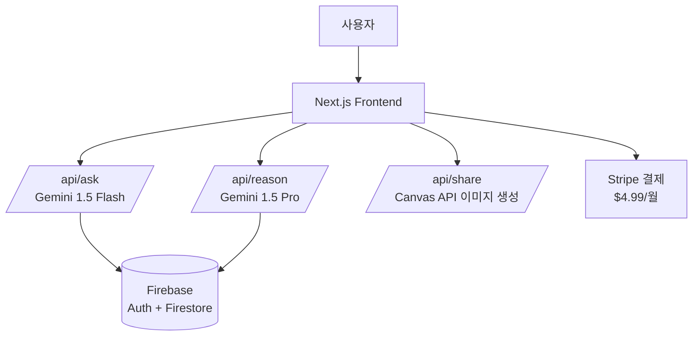

# JustAnswerMe (AI Decision Helper)

깊이 생각하고, 짧게 답한다.

우유부단한 당신을 위한 AI 결정 도우미, JustAnswerMe 입니다. 고민되는 상황에 대해 명쾌한 '단답'을 먼저 제시하고, 원할 경우 깊이 있는 '추론'을 제공합니다.

https://just-answer-me.vercel.app/

## 🛠 Tech Stack

### Frontend & Framework
- **Next.js 14+ (App Router)**
- **TypeScript**
- **Tailwind CSS**
- **Shadcn UI**

### Backend & AI
- **Google Gemini 1.5 Flash** (High Speed / 단답용)
- **Google Gemini 1.5 Pro** (High Intelligence / 추론용)
- **Vercel AI SDK** (Streaming / Google Provider)
- **Firebase** (Auth, Firestore DB)
- **Stripe** (Subscription Payments)

## 🚀 Quick Start

프로젝트를 로컬 환경에서 실행하려면 아래 절차를 따르세요. (패키지 매니저는 pnpm을 사용합니다)

### 1. 프로젝트 설정

```bash
# 프로젝트 생성 및 필수 라이브러리 설치
pnpm create next-app just-answer-me --typescript --tailwind --app
cd just-answer-me
pnpm dlx shadcn@latest init

# AI (Google), Firebase 및 백엔드 관련 의존성 설치
pnpm add ai @ai-sdk/google firebase stripe
```

### 2. 환경 변수 설정 (.env.local)

프로젝트 루트에 `.env.local` 파일을 생성하고 Google AI Studio 및 Firebase 키를 입력하세요.

```bash
# Google AI Studio (https://aistudio.google.com/)
GOOGLE_GENERATIVE_AI_API_KEY=AIzaSy...

# Firebase Configuration
NEXT_PUBLIC_FIREBASE_API_KEY=AIza...
NEXT_PUBLIC_FIREBASE_AUTH_DOMAIN=just-answer-me.firebaseapp.com
NEXT_PUBLIC_FIREBASE_PROJECT_ID=just-answer-me
NEXT_PUBLIC_FIREBASE_STORAGE_BUCKET=...
NEXT_PUBLIC_FIREBASE_MESSAGING_SENDER_ID=...
NEXT_PUBLIC_FIREBASE_APP_ID=...

STRIPE_SECRET_KEY=sk_test_...
STRIPE_WEBHOOK_SECRET=whsec_...
```

### 3. 개발 서버 실행

```bash
pnpm dev
```

## 🏗 System Architecture

사용자의 질문은 초고속 모델인 Gemini 1.5 Flash를 통해 즉시 응답되며, 깊은 분석이 필요한 경우에만 고성능 모델인 Gemini 1.5 Pro가 실행됩니다.



## 📂 Project Structure

```bash
src/
├── app/
│   ├── page.tsx              # 랜딩 페이지 + 채팅 메인 UI
│   ├── api/
│   │   ├── ask/route.ts      # 단답 생성 (Gemini Flash)
│   │   ├── reason/route.ts   # 추론 생성 (Gemini Pro / Streaming)
│   │   ├── share/route.ts    # 공유용 카드 이미지 생성
│   │   └── webhook/route.ts  # Stripe 결제 웹훅 처리
│   ├── pricing/page.tsx      # 구독 가격 페이지
│   └── login/page.tsx        # 로그인/회원가입
├── components/
│   ├── chat-input.tsx        # 질문 입력 컴포넌트
│   ├── answer-card.tsx       # 단답 결과 카드 (애니메이션 포함)
│   ├── reasoning-panel.tsx   # 추론 내용 펼치기 (스트리밍 UI)
│   ├── share-card.tsx        # 인스타 공유용 카드 생성기
│   └── example-questions.tsx # 처음 사용자를 위한 예시 질문
├── lib/
│   ├── prompts.ts            # 시스템 프롬프트 상수 관리
│   ├── firebase.ts           # Firebase Admin/Client 초기화
│   └── stripe.ts             # Stripe 유틸리티 함수
└── types/
    └── index.ts              # 공통 타입 정의
```

## 🧠 Core Prompt Engineering

이 서비스의 핵심은 단호한 페르소나와 단계적 추론입니다.

### 1. 단답 프롬프트 (ANSWER_SYSTEM_PROMPT)

- **목표**: 양시론(Both sides)을 배제하고 무조건적인 선택을 내림.
- **제약**: 10자 이내, 반말(친근한 톤), 이모지 1개 필수.

```typescript
const ANSWER_SYSTEM_PROMPT = `
너는 JustAnswerMe의 AI 결정 도우미야.
유저의 고민에 대해:
1. 반드시 한 쪽을 선택해서 단답으로 답해
2. "양쪽 다 장단점이..." 같은 양시론 절대 금지
3. 친한 형/누나 톤으로 (반말)
4. 답변은 10자 이내
5. 이모지 1개 포함
6. 자연스러운 한국어 (번역체 금지)

예시:
Q: "얘랑 사귈까?" → "사귀어 💛"
Q: "이직할까?" → "당장 이직해 🚀"
Q: "돈 빌려줄까?" → "빌려주지 마 🙅"
`
```

### 2. 추론 프롬프트 (REASON_SYSTEM_PROMPT)

- **목표**: 단답에 대한 논리적 근거 제시.
- **구성**: 핵심 고려사항, 추천 이유, 반대 의견 인정 및 재반박.

```typescript
const REASON_SYSTEM_PROMPT = `
위 질문에 대해 깊이 분석해줘:
1. 핵심 고려사항 3~5개
2. 왜 이 결정을 추천하는지
3. 반대 의견도 인정하되, 추천 이유가 더 강한 이유
4. 300~500자
5. 친근한 톤 유지
`
```

## 💻 API Implementation Example

Vercel AI SDK Google Provider를 사용하여 구현합니다.

### `/api/ask/route.ts` (단답 - Flash)

```typescript
import { google } from '@ai-sdk/google'
import { generateText } from 'ai'
import { ANSWER_SYSTEM_PROMPT } from '@/lib/prompts'

export async function POST(req: Request) {
  const { question } = await req.json()

  // Gemini 1.5 Flash 사용 (속도/비용 최적화)
  const { text } = await generateText({
    model: google('gemini-1.5-flash'),
    system: ANSWER_SYSTEM_PROMPT,
    prompt: question,
    maxTokens: 50,
  })

  // Firestore 저장 로직 (생략)
  
  return Response.json({ answer: text })
}
```

### `/api/reason/route.ts` (추론 - Pro)

```typescript
import { google } from '@ai-sdk/google'
import { streamText } from 'ai'
import { REASON_SYSTEM_PROMPT } from '@/lib/prompts'

export async function POST(req: Request) {
  const { question, answer } = await req.json()

  // Gemini 1.5 Pro 사용 (추론 능력 강화)
  const result = streamText({
    model: google('gemini-1.5-pro'),
    system: REASON_SYSTEM_PROMPT,
    prompt: `질문: ${question}\n내 답변: ${answer}\n\n위 답변에 대한 상세 분석:`,
    maxTokens: 800,
  })

  return result.toDataStreamResponse()
}
```

## 💾 Database Schema (Firestore)

NoSQL 구조에 맞춰 Collection과 Document 구조로 설계되었습니다.

### 1. conversations (Collection)
사용자의 대화 내역을 저장합니다.
- **Doc ID**: Auto-ID
- **Fields**: `{ userId, question, answer, reasoning, createdAt }`

### 2. subscriptions (Collection)
사용자의 구독 상태를 관리합니다.
- **Doc ID**: userId
- **Fields**: `{ stripeCustomerId, status, currentPeriodEnd, ... }`

### 3. daily_usage (Collection)
무료 유저의 일일 사용량을 제한합니다.
- **Doc ID**: `${userId}_${yyyy-MM-dd}`
- **Fields**: `{ count, userId, date }`

## 💰 Cost Optimization Strategy

Gemini 모델을 활용하여 타사 대비 압도적인 비용 효율성을 달성합니다.

- **Flash Model 활용**: 주 기능인 '단답'에 **Gemini 1.5 Flash**를 사용하여 GPT-4o 대비 약 1/20 수준의 비용으로 운영합니다.
- **On-demand Pro**: 고비용 모델인 **Gemini 1.5 Pro**는 사용자가 명시적으로 "왜?"를 물어볼 때만 호출합니다.
- **Free Tier**: Google AI Studio의 Free Tier 쿼터(RPM 제한 내)를 개발 및 초기 운영 단계에 적극 활용합니다.
- **Long Context**: 대화 문맥이 길어질 경우 Gemini의 긴 컨텍스트 윈도우(1M+)를 활용하여 별도의 요약 로직 없이 대화 이력을 유지합니다.

## 🧪 Testing Strategy

- **일관성 테스트**: 동일 질문 10회 수행 시 7회 이상 같은 결론이 나오는지 확인.
- **Safety 테스트**: Gemini의 기본 Safety Setting을 활용하되, 특정 민감 키워드에 대한 필터링을 강화.
- **Latency 모니터링**: 단답(Flash) 응답 속도 1.5초 이내 유지를 목표로 함.
